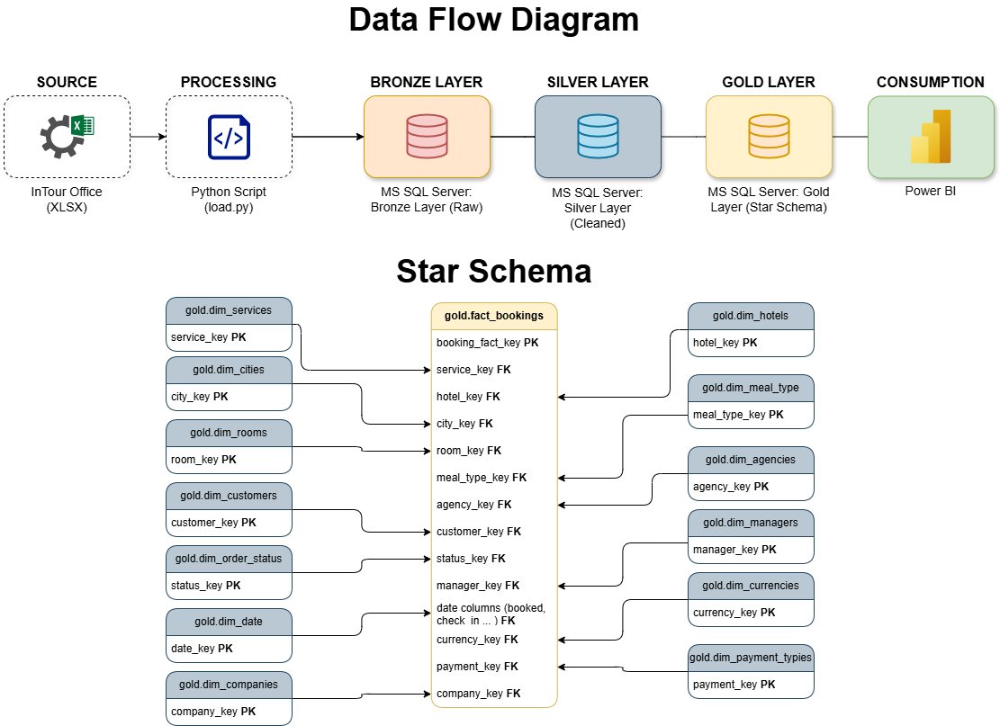

# 📑 Data Warehouse Project: Analytical System for a Tourist Agency (ITO Sales DWH)

## 🎯 Project Overview and Business Goal

This project establishes a comprehensive **Data Warehouse (DWH)** built on booking data sourced from the operational **InTour Office (ITO)** system.

**Main objective:** Transform raw operational data into a **clean, structured Kimball Star Schema**, optimized for fast and intuitive analysis by non-technical users (managers, analysts) through **Power BI**.

---

## 🧰 Technology Stack

| Component          | Technology           | Role in Project                                   |
| ------------------ | -------------------- | ------------------------------------------------- |
| **Source**         | InTour Office (XLSX) | Primary source of booking data                    |
| **Preprocessing**  | Python (Pandas)      | Initial cleanup, renaming, UTF‑8 normalization    |
| **Data Warehouse** | MS SQL Server        | Bronze–Silver–Gold layers, ETL orchestration      |
| **BI & Analysis**  | Power BI             | Dashboards for profit, manager efficiency, trends |

---

## 🏛️ Architecture and Data Flow (ETL Pipeline)

# Data Flow Diagram & Star Schema



The DWH uses a **layered architecture** orchestrated by a single stored procedure ensuring sequential execution, atomicity, and data integrity.

### Orchestration and Transaction Control

The entire ETL process executes via:

```sql
EXEC dbo.dwh_etl_pipeline;
```

**Key principle:** If any layer (Bronze, Silver, Gold) fails, the **ROLLBACK TRANSACTION** mechanism cancels the entire ETL run.

### Layer Overview

| Layer      | Purpose                                                  | Procedure            |
| ---------- | -------------------------------------------------------- | -------------------- |
| **Bronze** | Landing Zone — raw data via `BULK INSERT`                | `bronze.load_bronze` |
| **Silver** | Cleansing Zone — standardized, filtered, enriched        | `silver.load_silver` |
| **Gold**   | Analytical Layer — Star Schema (dim_* and fact_bookings) | `gold.load_gold`     |

---

## ⚙️ Implementation Details

### 1. Python Preprocessing (`load.py`)

Key tasks:

* Standardizes column names
* Cleans the **tourists** column (removes system tags, applies `unidecode`)
* Saves CSV (semicolon‑delimited, UTF‑8) optimized for `BULK INSERT CODEPAGE = '65001'`

### 2. Silver Layer Transformations (`silver.load_silver`)

* **Standardization:** e.g., `KARLSBAD` → `KARLOVY VARY`
* **Derived values:** `total_nights`
* **Filtering:** removal of test/system records

### 3. Gold Layer: Star Schema DDL

#### A. Fact Table (`gold.fact_bookings`)

**Granularity:** one row per booking/order.

**Categories:**

* **Measures:** `profit`, `price`, `total_nights`
* **Foreign Keys:** `manager_key`, `hotel_key`, `currency_key`, etc.
* **Date Roles:** 6 date keys → all linked to `dim_date`

**Unknown Member Principle:**
All foreign keys are **NOT NULL** — missing (NULL) values are replaced with surrogate key **-1**.

#### B. Dimensions

13 dimension tables, including:

* `dim_managers`
* `dim_hotels`
* `dim_cities`
* `dim_date` (Czech localized day/month names, YYYYMMDD natural key)

---

## 🔒 Monitoring and Logging

A centralized log table **gold.load_logs** provides:

* Status: `SUCCESS` / `FAILED`
* Duration
* Row counts
* Detailed `error_message` via `ERROR_MESSAGE()` on failure

---

## 👤 Author and Contact Information

**Author:** Alexander Kozhevnikov
**Role:** Data Engineer & Database Administrator
**Email:** [alex.kozhevnikovda@gmail.com](mailto:alex.kozhevnikovda@gmail.com)
**LinkedIn:** [https://www.linkedin.com/in/alexander-kozhevnikov](https://www.linkedin.com/in/alexander-kozhevnikov)
